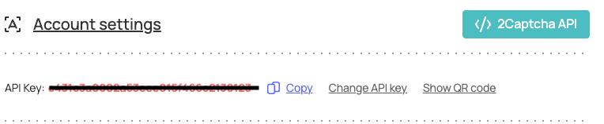

I'm sure _almost_ everyone on the internet at this point -- or at least reading this article -- knows what a captcha is. But just in case you don't, CAPTCHA is an acronym for "Completely Automated Public Turing test to tell Computers and Humans Apart". In simpler terms, it is a program set up on most modern websites and applications to differentiate between humans and automated software or bots. This adds an extra layer of security on the software and prevents cases like spams or hijacks. It makes sure the intended actions or use of the software is restricted to only human users.

The idea of captchas is a really good one, but we can all agree that they can be quite annoying and time-wasting to complete most times. Other times, it could be quite unhelpful trying to make users solve the captcha problems to prove they're humans. These captcha tasks can range from simple button clicks, scrambled text confirmations, or can get more complex like solving math problems or performing actions like drag and drops.

The most common type of captcha is the Google reCaptcha v2. For this, a captcha checkbox is displayed with the text "I'm not a robot" and the user is expected to click on the box and solve the task like identifying images based on the instruction given. This looks something like the image below:


In this article, I'll cover how to bypass captcha. To accomplish this bypass, we'll be using a captcha solver, [2Captcha](https://2captcha.com/), which is a captcha solving software commonly used for tasks like this. 2Captcha solves plenty other captcha types like normal captchas, text captchas, hCaptcha, TikTok Captchas, etc. But for the purpose of this article, we'll be using Google reCaptcha v2 as a case study.

Before we proceed, we need to set up a 2Captcha account so as to get an API key to make these bypass requests with. Head over to <https://2captcha.com/auth/register> to register (or sign in if you have an account already). You can then get your API KEY as shown below:


Once that is done and you can access the dashboard, proceed to fund your account as they have no trial/demo period and you need funds to make the requests. You can start with as low as $3 with PayPal and the balance reflects almost immediately once that is processed.
<br />
We can now go ahead to bypass reCaptcha. To test this, we'll use the official Google reCaptcha demo. Head over to <https://www.google.com/recaptcha/api2/demo> and open up the [developer console](https://balsamiq.com/support/faqs/browserconsole/). We shall now take the steps below to carry out the bypass.

## Locate reCaptcha Site Key
The first thing we need to do is to locate the Google reCaptcha site key. We can easily find this in most cases by inspecting the reCaptcha box element and looking for the parent container with class name "g-recaptcha". The key is stored here with the data attribute "sitekey".

Save this key as such:
```js
var reCaptcha = document.querySelector('.g-recaptcha');
var sitekey = reCaptcha.dataset.sitekey;
var API_KEY = <YOUR_2CAPTCHA_API_KEY>;
```

<br>

## Build the Bypass Request URL
To make our work neat and concise, let us build and store the bypass request url key for 2Captcha.
```js
var byPassUrl = `https://2captcha.com/in.php?key=${API_KEY}&method=userrecaptcha&googlekey=${sitekey}&pageurl=https://www.google.com/recaptcha/api2/demo&json=1`;
```
Remember to replace `API_KEY` with your real API key from 2Captcha. The `pageurl` param in the request URL should be the same as the URL of the page where you need to bypass.

<br>

## Make the Requests
Now, we need to do a couple more things. Firstly, we need to make the request to 2Captcha to bypass the captcha. But then, we also need to actively listen for, and react accordingly to the status of the request as the bypass is not instantaneous. We need to set up a listener that queries the bypass request at intervals to check if it has been done successfully, or not.
When we send the initial bypass request, 2Captcha returns the request ID which we can now use to subsequently check for its bypass status and act accordingly:

```js
fetch(byPassUrl).then(res => res.json()).then(res => {
    // initiate bypass request
    requestID = res.request;

    // bypass request check params
    var checkRequestCount = 0;
    var checkRequestLimit = 20;
    var checkRequestInterval = 5000;
    
    const checkCaptchaResult = setInterval(() => {
        checkRequestCount++;

        var checkResultUrl = `https://2captcha.com/res.php?key=${API_KEY}&action=get&id=${requestID}&json=1`;

        console.log('checking bypass status');

        fetch(checkResultUrl).then(res => res.json()).then(res => {
            if (res.status == 1) {
                console.log('bypass sucessful', res.request);
                // bypass successful
                // next steps depends on how the implementing website or app handles the recaptcha success

                // fill the g-recaptcha-response with the request token and attempt to submit the form 
                document.querySelector("#g-recaptcha-response").innerHTML = res.request;
                // submit form by clicking button programmatically
                document.querySelector("#recaptcha-demo-submit").click();

                // in other cases, check for recaptcha success callback and invoke it
                // for more info: https://2captcha.com/2captcha-api#callback
                var reCaptchaCallback = reCaptcha.dataset.callback;
                if (reCaptchaCallback) {
                    window[reCaptchaCallback]();
                }
                
                clearInterval(checkCaptchaResult);
            }

            if (res.request.startsWith('ERROR_')) {
                // An error occured. Cancel request and retry bypass
                clearInterval(checkCaptchaResult);
            }
        })

        if (checkRequestCount == checkRequestLimit) {
            // request limit reached. Cancel request and retry
            clearInterval(checkCaptchaResult);
        }

    }, checkRequestInterval)
})
```

Above, we query every 5 seconds for the status of the bypass and if successful, we programmatically fill the reCaptcha token and then submit the form. This _post-reCaptcha_ action varies from site to site and it is your duty to find out what the individual site does, or how it handles the reCaptcha verification when it is successful. In some cases, it calls a function, starts a download, enables/displays a previously disabled/hidden button or redirects to a page. In this simple case, it submits a form.

If this is successful, we should see a "Verification Success... Hooray!" text displayed on the page.

For the full code, you can check out [this gist](https://gist.github.com/kingingcole/d0ac0423534d5898eaf5663c8be8f5ec).

Thanks, and happy bypassing -- I'm pretty sure you're not a bot!
