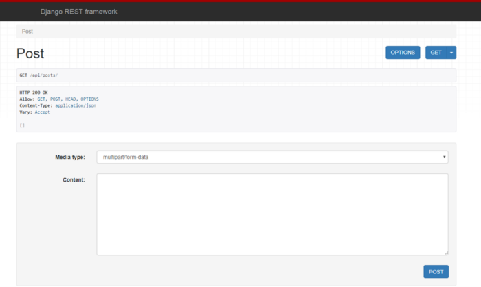

So I would be writing about a very challenging task I faced when building a test project for a job I applied to: I was asked to build a React app that lets users add products with descriptions, categories, and an image, while utilising an API. So the issue was that I have built a few learning apps that gets data from a React form and send it to a backend through an API POST call to a REST API - but never an image!
I spent a good amount of time that day (and the next!) trying to get this done. I came across a lot of tutorials and articles online saying to utilize FormData, but just could not get my head around it.
So after lots of trials and heartbreaks, I got it done, and I am here to teach you how to do it.

>DISCLAIMERS:
>
>This tutorial assumes you have basic knowledge of Django and React JS. This is not a tutorial for them.
>
>The processes here uses django and django rest framework for its backend configurations. But the React logic works for any backend framework - just do a little bit more googling regarding your framework. 
   
 <br />

###Tools and Frameworks
- React: We will be using React to build the UI components for our form. I presume by now you understand the conecpt of React and what it is.

- Axios: We shall use axios to make the post requests. Axios is a Promise based HTTP client for the browser and node.js. It is used to make XMLHttpRequests to a server.

- Django: Django is a web framework for the Python programming language.

- Django Rest Framework: DRF is a framework (a Django app — actually) that enables us build simple but yet highly customizable RESTful APIs.

- Django-CORS-Headers: django-cors-headers is a Django application for handling the server headers required for Cross-Origin Resource Sharing (CORS).

- Pillow: This is a Python Image Library you need to have installed when your models have an image field, else you will get an error when running migrations and migrating.

<br/>

###Project Setup:
_Please note the command lines I will be using here is for Windows_

The project will be divided into two directories — frontend and backend.
So cd into your preferred directory and create the root project folder:

```shell
#cmd

mkdir react-form-data && cd react-form-data
```

Now, we will create two folders frontend and backend which will contain the codes respectively.
The front end will be created by [create-react-app](https://facebook.github.io/create-react-app/) — which I assume you are comfortable with — while the backend will be with django-admin.

Now while in the react-form-data directory, run the following commands:
```shell
#cmd

mkdir backend && cd backend
django-admin startproject backend .
cd .. && npx create-react-app frontend
```
The code above creates a backend directory and we move into it to create our django app also called backend. Remember to add the . so as not to create another folder there.

###Getting Started:
We will start with the backend.<br/>As with most Python projects, we need to set up a virtual environment, using virtualenv. `cd` into the root `react-form-data` project folder with CLI and type in `virtualenv env` and start up the virtual environment with `env\Scripts\activate`. On running la in your root project folder you should see:

```
backend env frontend
```
Now, making sure the virtual environment is running, run the following in CLI to install the required packages:

```python
cd backend
pip install django djangorestframework django-cors-headers Pillow
```

This installs the required packages. Now open the settings.py file in your favorite IDE and update the INSTALLED_APPS to include the installed apps:
```python
INSTALLED_APPS = [
    ...,
    'rest_framework',  # for rest api
    'corsheaders',  # for cors policies
]
```
Now we create our own ‘post’ app to handle the API logic and views.
<br/>cd into the root `backend` directory and run `python manage.py startapp post`. Remember to include this in `INSTALLED_APPS`. 

Next, add these two lines
 ```py
'corsheaders.middleware.CorsMiddleware'
```
and 
```py
'django.middleware.common.CommonMiddleware'
```
above other lines in the MIDDLEWARE section, making sure 
 ```py
 corsheaders.middleware.CorsMiddleware
 ```
 above all others. Your middlewares should look like these:
```python
MIDDLEWARE = [
    'corsheaders.middleware.CorsMiddleware',
    'django.middleware.common.CommonMiddleware',
    'django.middleware.security.SecurityMiddleware',
    'django.contrib.sessions.middleware.SessionMiddleware',
    'django.middleware.common.CommonMiddleware',
    'django.middleware.csrf.CsrfViewMiddleware',
    'django.contrib.auth.middleware.AuthenticationMiddleware',
    'django.contrib.messages.middleware.MessageMiddleware',
    'django.middleware.clickjacking.XFrameOptionsMiddleware',
]
```
Right below the MIDDLEWARE section, add this line: `CORS_ORIGIN_ALLOW_ALL = True`. This enables all API requests from a different server to be allowed. 
Also, since we are dealing with uploaded images, add the following to the bottom of your settings.py file:
```python
MEDIA_ROOT = os.path.join(BASE_DIR, 'media')
MEDIA_URL = '/media/'
```
Overall, your settings.py file should look like this:
```python
Django settings for backend project.
Generated by 'django-admin startproject' using Django 2.1.7.
For more information on this file, see
https://docs.djangoproject.com/en/2.1/topics/settings/
For the full list of settings and their values, see
https://docs.djangoproject.com/en/2.1/ref/settings/
"""

import os

# Build paths inside the project like this: os.path.join(BASE_DIR, ...)
BASE_DIR = os.path.dirname(os.path.dirname(os.path.abspath(__file__)))

# Quick-start development settings - unsuitable for production
# See https://docs.djangoproject.com/en/2.1/howto/deployment/checklist/

# SECURITY WARNING: keep the secret key used in production secret!
SECRET_KEY = '9zff9-n4#2g--_$4@g4uu-zauef(s^i3^z_!7wtpzduma59ku8'

# SECURITY WARNING: don't run with debug turned on in production!
DEBUG = True

ALLOWED_HOSTS = []

# Application definition

INSTALLED_APPS = [
    'django.contrib.admin',
    'django.contrib.auth',
    'django.contrib.contenttypes',
    'django.contrib.sessions',
    'django.contrib.messages',
    'django.contrib.staticfiles',
    'post',
    'rest_framework',  # for django rest api
    'corsheaders',  # for rest api
]

MIDDLEWARE = [
    'corsheaders.middleware.CorsMiddleware',
    'django.middleware.common.CommonMiddleware',
    'django.middleware.security.SecurityMiddleware',
    'django.contrib.sessions.middleware.SessionMiddleware',
    'django.middleware.common.CommonMiddleware',
    'django.middleware.csrf.CsrfViewMiddleware',
    'django.contrib.auth.middleware.AuthenticationMiddleware',
    'django.contrib.messages.middleware.MessageMiddleware',
    'django.middleware.clickjacking.XFrameOptionsMiddleware',
]

CORS_ORIGIN_ALLOW_ALL = True

ROOT_URLCONF = 'backend.urls'

TEMPLATES = [
    {
        'BACKEND': 'django.template.backends.django.DjangoTemplates',
        'DIRS': [],
        'APP_DIRS': True,
        'OPTIONS': {
            'context_processors': [
                'django.template.context_processors.debug',
                'django.template.context_processors.request',
                'django.contrib.auth.context_processors.auth',
                'django.contrib.messages.context_processors.messages',
            ],
        },
    },
]

WSGI_APPLICATION = 'backend.wsgi.application'

# Database
# https://docs.djangoproject.com/en/2.1/ref/settings/#databases

DATABASES = {
    'default': {
        'ENGINE': 'django.db.backends.sqlite3',
        'NAME': os.path.join(BASE_DIR, 'db.sqlite3'),
    }
}

# Password validation
# https://docs.djangoproject.com/en/2.1/ref/settings/#auth-password-validators

AUTH_PASSWORD_VALIDATORS = [
    {
        'NAME': 'django.contrib.auth.password_validation.UserAttributeSimilarityValidator',
    },
    {
        'NAME': 'django.contrib.auth.password_validation.MinimumLengthValidator',
    },
    {
        'NAME': 'django.contrib.auth.password_validation.CommonPasswordValidator',
    },
    {
        'NAME': 'django.contrib.auth.password_validation.NumericPasswordValidator',
    },
]

# Internationalization
# https://docs.djangoproject.com/en/2.1/topics/i18n/

LANGUAGE_CODE = 'en-us'

TIME_ZONE = 'UTC'

USE_I18N = True

USE_L10N = True

USE_TZ = True

# Static files (CSS, JavaScript, Images)
# https://docs.djangoproject.com/en/2.1/howto/static-files/

STATIC_URL = '/static/'

MEDIA_ROOT = os.path.join(BASE_DIR, 'media')
MEDIA_URL = '/media/'

```
Now let us create our models for the posts. 
Open up post/models.py and paste in the following code:
```python
from django.db import models

# Create your models here.

class Post(models.Model):
    title = models.CharField(max_length=100)
    content = models.TextField()
    image = models.ImageField(upload_to='post_images')
    
    def __str__(self):
        return self.title
```
Create a new media directory at the same level as manage.py to store our uploaded images.
Now, to register our model. Open up post/admin.py and paste the followng code:
```python
from django.contrib import admin
from .models import Post

# Register your models here.

admin.site.register(Post)
```
Now, you must be wondering, when do we run migrations? Now! With the command line, `cd ` into the root project folder and run:
`python manage.py makemigrations` and then `python manage.py migrate.`<br/>
Now, to the juicy part — serializers! Serializers is a way to convert Python data to API JSON format and vice-versa.
Create a new serializers.py file in the post directory an paste the code:
```py

from rest_framework import serializers
from .models import Post

class PostSerializer(serializers.ModelSerializer):
    class Meta:
        model = Post
        fields = '__all__'
```
We just created a new class that extends the ModelSerializer of DRF. model in class Meta just specifies the model to use, while fields can be a tuple or list holding the individual fields in the model, or takes in `__all__`  to just serialize all fields.
Now, open up the post/views.py file and paste the following:
```py
from .serializers import PostSerializer
from .models import Post
from rest_framework.views import APIView
from rest_framework.parsers import MultiPartParser, FormParser
from rest_framework.response import Response
from rest_framework import status
# Create your views here.

class PostView(APIView):
    parser_classes = (MultiPartParser, FormParser)

    def get(self, request, *args, **kwargs):
        posts = Post.objects.all()
        serializer = PostSerializer(posts, many=True)
        return Response(serializer.data)

    def post(self, request, *args, **kwargs):
        posts_serializer = PostSerializer(data=request.data)
        if posts_serializer.is_valid():
            posts_serializer.save()
            return Response(posts_serializer.data, status=status.HTTP_201_CREATED)
        else:
            print('error', posts_serializer.errors)
            return Response(posts_serializer.errors, status=status.HTTP_400_BAD_REQUEST)


```
I believe you understand the imports . The `parser_class` is used because we are dealing with request data that comes in as FormData. Two class methods `get` and `post` are defined to handle the respective requests.
<br/>Now, to the urls. Create a new `urls.py` file in the post directory. Open it and add the following code:
```py

from django.urls import path
from . import views

urlpatterns = [
    path('posts/', views.PostView.as_view(), name= 'posts_list'),
]
```
Now, to add this new url to our project urls, open up backend/urls.py and change the code to this:
```py
from django.contrib import admin
from django.urls import path, include

urlpatterns = [
    path('admin/', admin.site.urls),
    path('api/', include('post.urls')),
]
```
Now, let us create a super user and test what we have been doing all along. With command line, cd into the root backend directory and `run python manage.py createsuperuser` and follow the prompts to create one. Now fire up the server by running `python manage.py runserver` and go to [localhost:8000/api/posts](https://www.localhost:8000/api/posts). You will be greeted with the following page, if everything works out well:
 
 
 
 Now, no posts can be seen cos we have not added any. Navigate to [localhost:8000/admin](https://localhost:8000/admin) to add a few posts. Done? Navigate back to [https://localhost:8000/api/posts](localhost:8000/api/posts). You should get this — but with the data you put in.
 
 
 Now, our backend works correctly. Now to React.


Remember we had already created a React `frontend` directory with `create-react-app`. Now, using the command line, `cd` into the `frontend` directory and run ` npm install axios`. This installs axios for making the HTTP requests. Now run `npm run start`. We should be greeted with the popular React welcome page.
Now open the `frontend` directory in your editor and let us start by clearing a few things — delete the `App.css` , `logo.svg` and `App.test.js` files as we would not be needing them. Don’t forget to remove lines where they are referenced in `App.js`.<br/>
As this is a little project, our code will live in `App.js` 
Modify your `App.js` file to look like:
```jsx
import React, { Component } from 'react';
import axios from 'axios';

class App extends Component {

  state = {
    title: '',
    content: '',
    image: null
  };

  handleChange = (e) => {
    this.setState({
      [e.target.id]: e.target.value
    })
  };

  handleImageChange = (e) => {
    this.setState({
      image: e.target.files[0]
    })
  };

  handleSubmit = (e) => {
    e.preventDefault();
    console.log(this.state);
    let form_data = new FormData();
    form_data.append('image', this.state.image, this.state.image.name);
    form_data.append('title', this.state.title);
    form_data.append('content', this.state.content);
    let url = 'http://localhost:8000/api/posts/';
    axios.post(url, form_data, {
      headers: {
        'content-type': 'multipart/form-data'
      }
    })
        .then(res => {
          console.log(res.data);
        })
        .catch(err => console.log(err))
  };

  render() {
    return (
      <div className="App">
        <form onSubmit={this.handleSubmit}>
          <p>
            <input type="text" placeholder='Title' id='title' value={this.state.title} onChange={this.handleChange} required/>
          </p>
          <p>
            <input type="text" placeholder='Content' id='content' value={this.state.content} onChange={this.handleChange} required/>

          </p>
          <p>
            <input type="file"
                   id="image"
                   accept="image/png, image/jpeg"  onChange={this.handleImageChange} required/>
          </p>
          <input type="submit"/>
        </form>
      </div>
    );
  }
}

export default App;

```
I am going to try and explai what is going on here, as this is the main focus of this article.

* In `line 1` and `line 2` , we imported React (and Component) and axios respectively.
* In `line 6` we set our initial state, which is just the respective fields in our `post` model. We use this to pass the FormData to the backend.
* `line 12` is where we handle form value changes to set our state to the value of the new input value. This method of using states in our forms in React is called [Controlled Forms](https://reactjs.org/docs/forms.html#controlled-components).
* `line 18` is an important one. We also set the state, but now the image property of our state is set to the the first file data of the event target, since the target is an array of files.
* Another important part is the `handleSubmit` method in `line 24`. First, the default character of forms — which is reloading the web page — is prevented. Then a new instance of the in-built JavaScript’s FormData is instantiated by calling `new FormData()` in `line 27` . One method of the FormData is `append` which takes in two required parameters — a key:value pair — with the first parameter being the **key** while the second is the **value**. The key should correspond to the field in your django models — this is important to avoid errors! The `append` method is called on the FormData passing in three different times to add the form values, now saved in the state. The FormData is now one large parcel of data that is now passed as the body of our axios `POST` call to our Django REST API.
* Please make note of the `content-type` in the axios headers. It should be set to `multipart/form-data`.

Now, go back to the web page and try to fill in the forms and add an image. Submit. You will get a JSON response logged in your console with the request data, and an ID — which shows it has been successfully uploaded to the backend and a new object created. To verify this, go to [localhost:8000/api/posts](http://localhost:8000/api/posts/) (with your django local server running, of course) and you will see the newly added post.

Thanks for following along and I hope you got it right.
